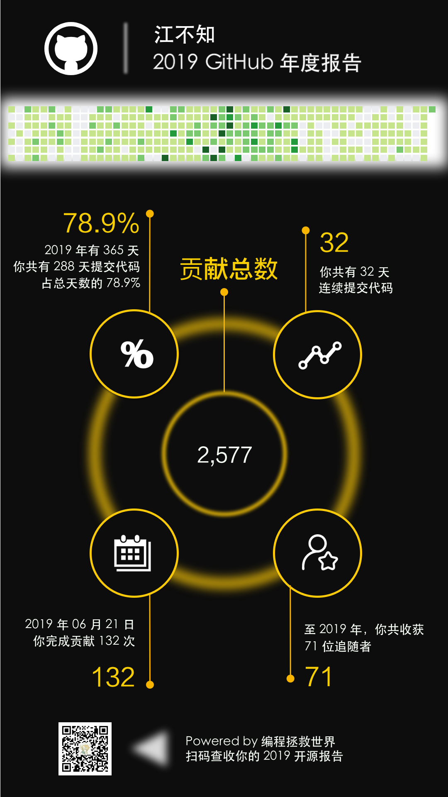

# GitHub 2019 年度报告

指定 GitHub ID，生成一份该用户的 2019 GitHub 年度报告，基于 Python 3.7.4。

报告主要数据包括：

- GitHub 「编码日历」
- 2019 年提交贡献总次数
- 2019 年提交代码总天数
- 2019 年连续提交代码的最大天数
- 2019 年完成贡献次数最多的日期

最终生成报告如下：



## 如何运行

在 `annual_report.py` 构造函数中写入你的 GitHub 账号 `access_token`：

```python
self.g = Github("你的 GitHub access_token")
```

调用 `AnnualReport` 中的 `draw()` 函数绘制报告：

```python
ar = AnnualReport(github_id="JalanJiang")
image = ar.draw()
```

可以运行 `main.py` 中的 Demo 查看效果。

## 其他

报告模板放置在 `./img/github.png`，`draw()` 函数绘制时指定坐标均基于此报告模板。

### GitHub API 文档

- [User](https://developer.github.com/v4/object/user/)
    - [ContributionsCollection](https://developer.github.com/v4/object/contributionscollection/)
    - [ContributionCalendar](https://developer.github.com/v4/object/contributioncalendar/)